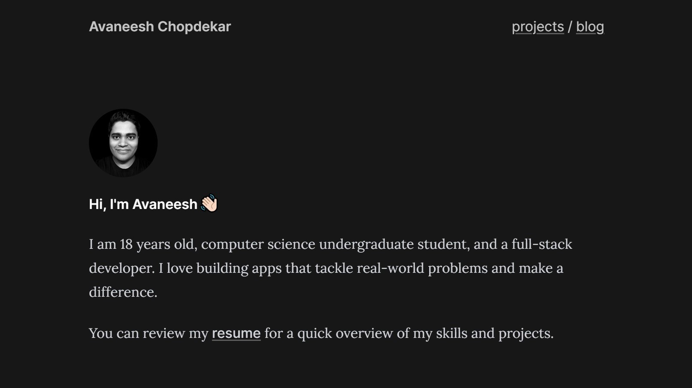

# Welcome to Avaneesh Chopdekar's Portfolio

A minimal portfolio and blog built with Astro, Tailwind and Typescript, an no frameworks.  
It was made on top of [Astro Nano Template](https://github.com/markhorn-dev/astro-nano).

## 📋 Features

- [x] 100/100 Lighthouse performance
- [x] Responsive
- [x] Accessible
- [x] SEO-friendly
- [x] Typesafe
- [x] Minimal style
- [x] Light/Dark Theme
- [x] Animated UI
- [x] Tailwind styling
- [x] Auto generated sitemap
- [x] Auto generated RSS Feed
- [x] Markdown support
- [x] MDX Support (components in your markdown)

## 💯 Lighthouse score

## ✅ Todo

- [x] Dynamic open graph image
- [ ] i18n

## 🏛️ License

MIT
